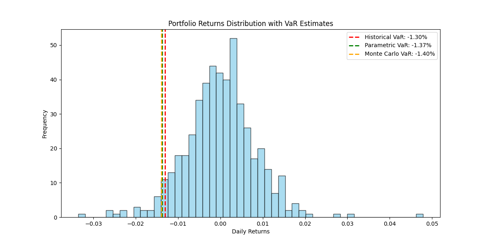
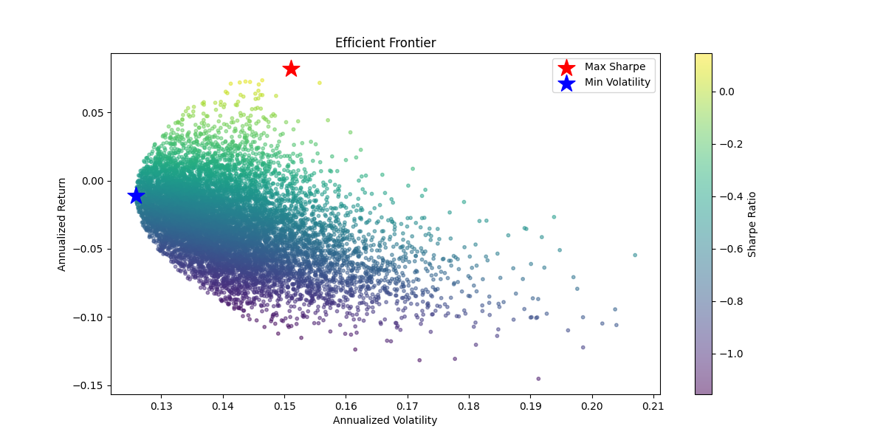
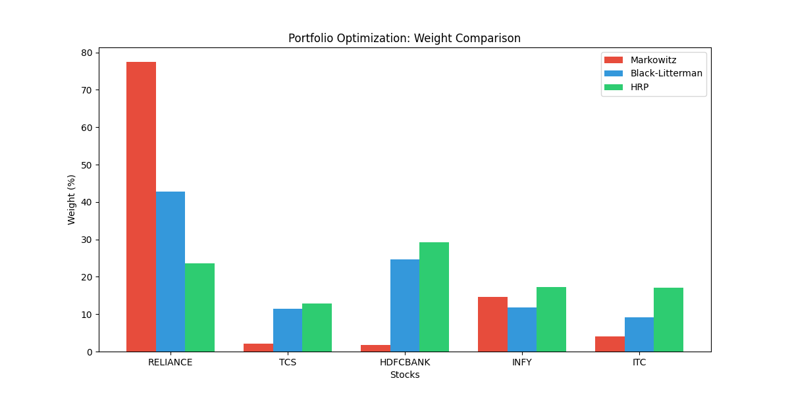
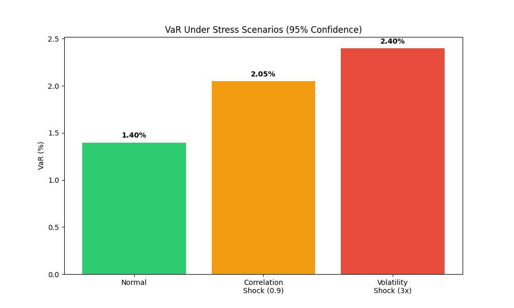
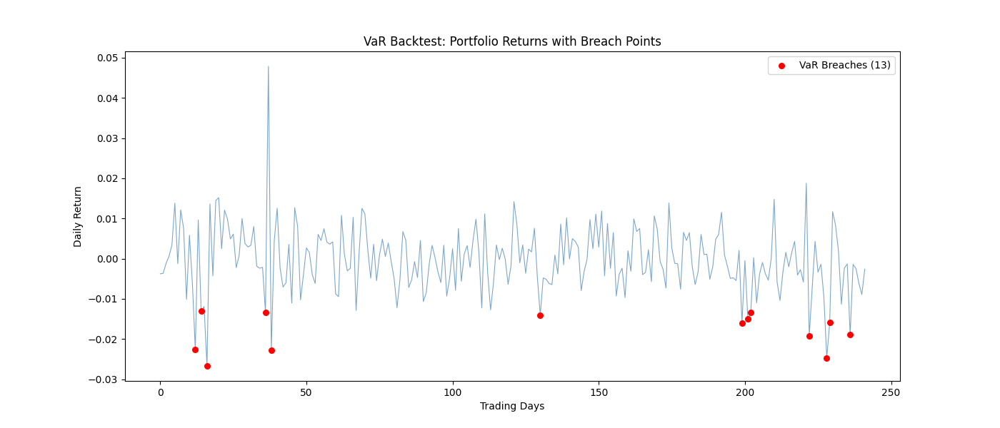
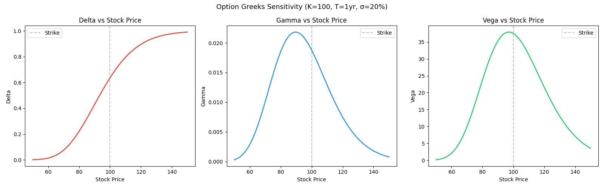

# Quantitative Risk Analytics Platform

A risk management platform built from scratch in Python. Covers derivatives pricing, VaR modeling, portfolio optimization, and stress testing — applied on a real portfolio of Indian stocks using live market data from Yahoo Finance.

Built to understand how risk is actually measured and managed at firms like banks and asset managers — not just the theory but the full implementation.

## Live Dashboard
```bash
pip install numpy scipy pandas matplotlib yfinance streamlit
streamlit run dashboard.py
```

The dashboard connects all 4 phases — select any NSE tickers, adjust confidence level, and explore risk metrics, optimization methods, and stress scenarios interactively.

## Key Results

| Metric | Value |
|--------|-------|
| Historical VaR (95%) | -1.30% |
| Parametric VaR (95%) | -1.37% |
| Monte Carlo VaR (95%) | -1.39% |
| COVID March 2020 Stress Loss | -20.30% |
| VaR Backtest (Kupiec Test) | PASS |

On a ₹10L portfolio, worst expected daily loss is ~₹13,000 under normal conditions. Under a COVID-like crash, that jumps to ₹2L+ in a single month.

## What's Inside

**Phase 1 — Pricing Engine:** Black-Scholes pricing, Greeks (Delta, Gamma, Vega, Theta, Rho) for calls and puts, Monte Carlo simulation, bond pricing with YTM and duration.

**Phase 2 — Value at Risk:** Historical, Parametric, and Monte Carlo VaR using Cholesky decomposition for correlated simulations. CVaR, Sharpe, Sortino, and max drawdown.

**Phase 3 — Portfolio Optimization:** Markowitz efficient frontier, Black-Litterman model with investor views, and Hierarchical Risk Parity. All three compared side by side.

**Phase 4 — Stress Testing:** Correlation shocks, volatility shocks, COVID scenario replay. Rolling window VaR backtest validated with Kupiec's likelihood ratio test.

## Visualizations








## Project Structure
```
├── dashboard.py
├── data/
│   ├── data_loader.py
│   └── portfolio.py
├── src/
│   ├── pricing/
│   ├── risk/
│   ├── optimization/
│   └── stress_testing/
├── tests/
└── docs/
```

## How to Run
```bash
pip install numpy scipy pandas matplotlib yfinance streamlit

# Run the dashboard
streamlit run dashboard.py

# Run individual modules
python3 src/risk/historical_var.py
python3 src/optimization/efficient_frontier.py

# Run all tests
python3 -m pytest tests/ -v
```

## Built With

Python · NumPy · SciPy · Pandas · Matplotlib · yfinance · Streamlit