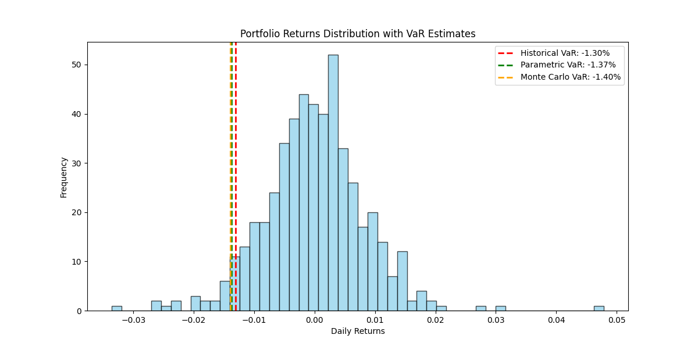
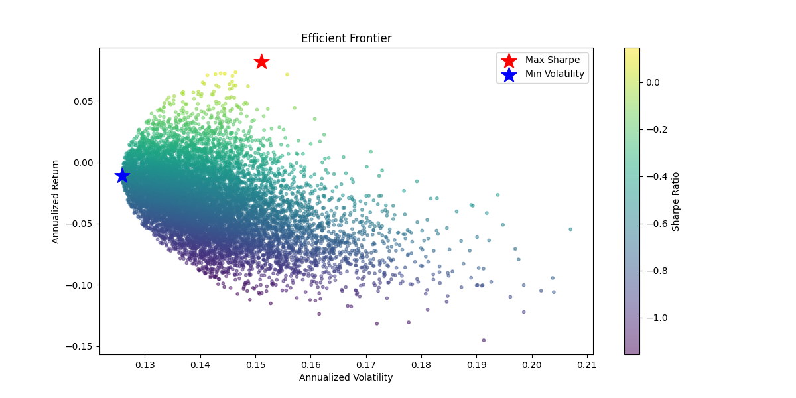
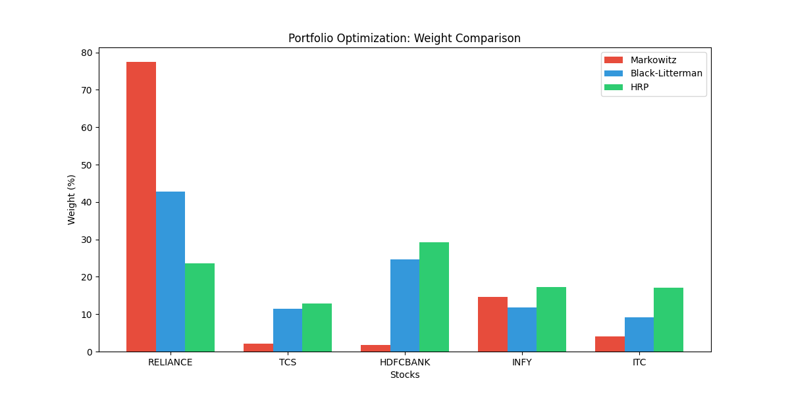
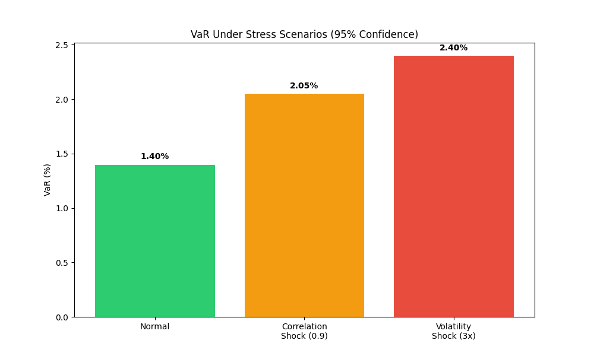
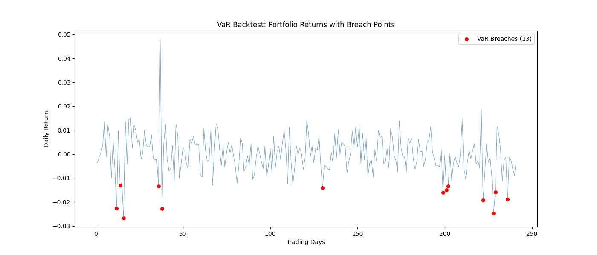
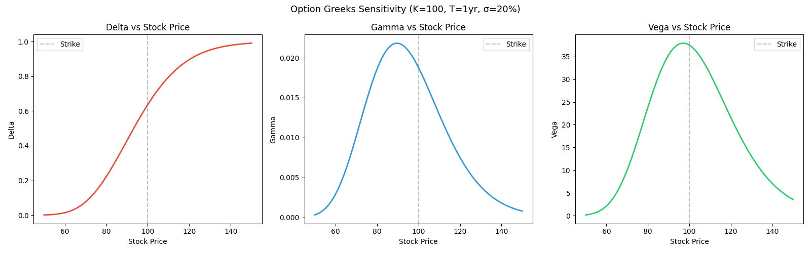

# Quantitative Risk Analytics Platform

**Live Demo:** [quantriskplatform.streamlit.app](https://quantriskplatform.streamlit.app)

A risk management platform built from scratch in Python. Covers derivatives pricing, VaR modeling, portfolio optimization, and stress testing — applied on a real portfolio of Indian stocks using live market data from Yahoo Finance.

Built to understand how risk is actually measured and managed at firms like banks and asset managers — not just the theory but the full implementation.

## Live Dashboard
```bash
pip install numpy scipy pandas matplotlib yfinance streamlit
streamlit run dashboard.py
```

The dashboard connects all 4 phases — select any NSE tickers, adjust confidence level, and explore risk metrics, optimization methods, and stress scenarios interactively.

## Key Results

*Portfolio: 5 NSE large-caps (30/25/20/15/10). Rolling 2-year window, as of 2026-09-04. Prices dividend-adjusted.*

| Metric | Normal | Student-t (ν≈7.6) |
|--------|--------|-------------------|
| Monte Carlo VaR (95%) | -1.57% | -1.54% |
| Monte Carlo VaR (99%) | -2.20% | -2.39% |
| Monte Carlo CVaR (95%) | -1.96% | -2.07% |
| Monte Carlo CVaR (99%) | -2.51% | -2.96% |

Degrees of freedom are estimated from the data (MLE 7.56, method-of-moments 7.50). The two distributions are variance-matched, so the difference is tail shape alone. They cross at **96.61% confidence** — below that the normal is more conservative, above it the t is. Basel measures market-risk VaR at 99% and FRTB at 97.5% Expected Shortfall, both above the crossover: on this portfolio the normal assumption understates 99% Expected Shortfall by 18% (₹25,090 vs ₹29,570 on ₹10L).

Historical CVaR at 95% (−2.07%) matches the t model (−2.07%) rather than the normal (−1.96%). That is supportive since the historical method assumes no distribution — though with roughly 25 observations in the tail, a two-year sample cannot separate them decisively.

| Metric | Value |
|--------|-------|
| Historical VaR (95%) | -1.56% |
| Historical CVaR (95%) | -2.07% |
| Parametric VaR (95%) | -1.57% |
| COVID March 2020 Replay | -20.30% |

### Backtesting Historical VaR (95%, 252-day rolling window)

| Test | Statistic | df | Result |
|------|-----------|----|--------|
| Kupiec unconditional coverage | LR = 6.42 (p = 0.011) | 1 | **REJECT** |
| Christoffersen independence | LR = 0.59 (p = 0.44) | 1 | do not reject |
| Conditional coverage | LR = 7.01 (p = 0.030) | 2 | **REJECT** |

248 days tested, 22 breaches against 12 expected (8.9% realised vs 5% target). The model breaches too often.

Transition counts: n₀₀=206, n₀₁=19, n₁₀=19, n₁₁=3, giving π₀₁ = 0.084 and π₁₁ = 0.136. Breaches are directionally more likely the day after a breach, but nowhere near significantly so: under independence 1.96 consecutive pairs are expected and 3 were observed, and n₁₁ would need to reach 5 before the test rejects. The independence test has almost no power at this sample size.

Conditional coverage rejects, but 92% of that statistic comes from the coverage component — the rejection is driven by *how many* breaches occurred, not *when*. Attributing it to clustering would be wrong.

The breach plot shows visible clustering over weeks and months, which a first-order Markov test cannot detect. A duration-based test (Christoffersen & Pelletier, 2004), which models time between breaches, would be the correct instrument. Not implemented.

On a 5-year window the same model passes Kupiec (55 breaches vs 49 expected, LR 0.66). Unconditional coverage over five years conceals a two-year stretch where the model is badly miscalibrated — which is itself an argument for conditional testing.

## What's Inside

**Phase 1 — Pricing Engine:** Black-Scholes pricing, Greeks (Delta, Gamma, Vega, Theta, Rho) for calls and puts, Monte Carlo simulation, bond pricing with YTM and duration.

**Phase 2 — Value at Risk:** Historical, Parametric, and Monte Carlo VaR using Cholesky decomposition for correlated simulations. CVaR, Sharpe, Sortino, and max drawdown.

**Phase 3 — Portfolio Optimization:** Markowitz efficient frontier, Black-Litterman model with investor views, and Hierarchical Risk Parity. All three compared side by side.

**Phase 4 — Stress Testing:** Correlation shocks, volatility shocks, COVID scenario replay. Rolling window VaR backtest validated with Kupiec's likelihood ratio test.

## Visualizations








## Project Structure
```
├── dashboard.py
├── data/
│   ├── data_loader.py
│   └── portfolio.py
├── src/
│   ├── pricing/
│   ├── risk/
│   ├── optimization/
│   └── stress_testing/
├── tests/
└── docs/
```

## How to Run
```bash
pip install numpy scipy pandas matplotlib yfinance streamlit

# Run the dashboard
streamlit run dashboard.py

# Run individual modules
python3 src/risk/historical_var.py
python3 src/optimization/efficient_frontier.py

# Run all tests
python3 -m pytest tests/ -v
```

## Built With

Python · NumPy · SciPy · Pandas · Matplotlib · yfinance · Streamlit