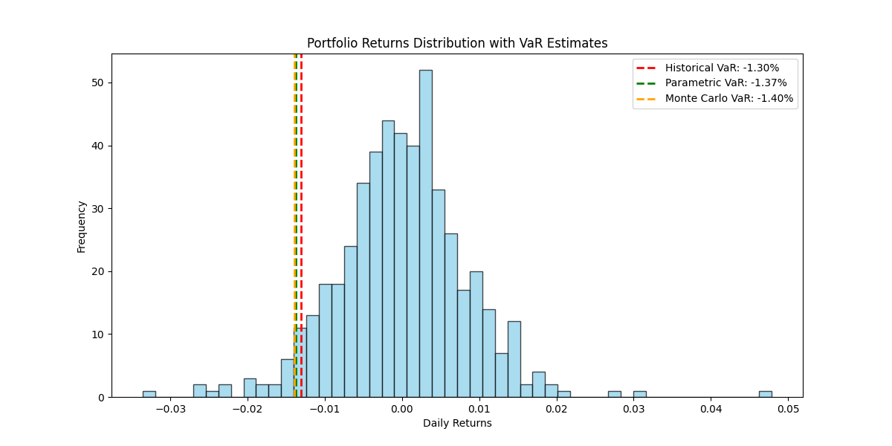
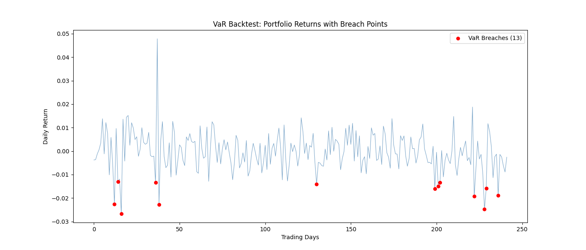
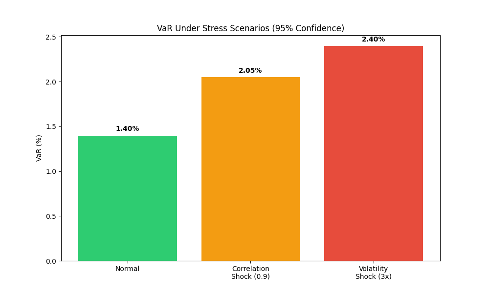
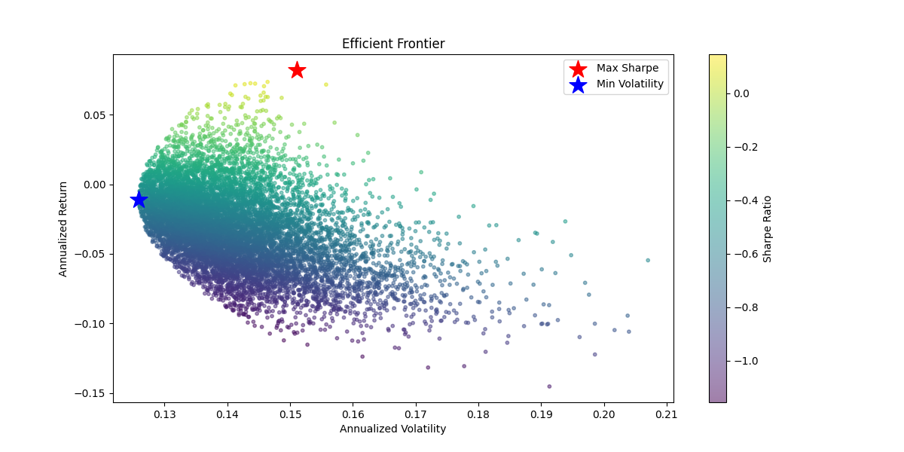
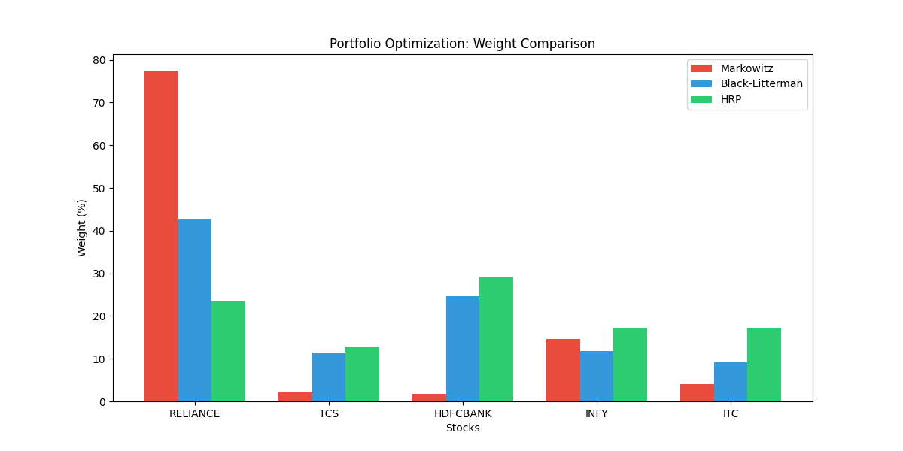
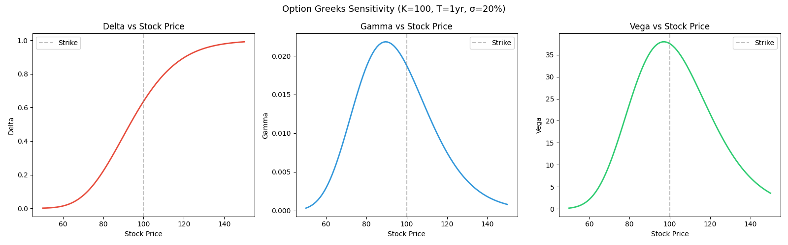

# Quantitative Risk Analytics Platform

**Live demo:** [quantriskplatform.streamlit.app](https://quantriskplatform.streamlit.app)

Value-at-Risk, VaR backtesting, portfolio optimisation and stress testing, written in Python and run on a five-stock NSE portfolio. The results below include the ones where the model fails, and the assumptions section lists what the numbers depend on.

## Portfolio and data

| | |
|---|---|
| Stocks | RELIANCE.NS, TCS.NS, HDFCBANK.NS, INFY.NS, ITC.NS |
| Weights | 30 / 25 / 20 / 15 / 10, fixed |
| Window | Rolling 2 years, 500 trading days, 2024-09-05 to 2026-09-04 |
| Data | Yahoo Finance via `yfinance`, dividend-adjusted closes (`auto_adjust=True`) |
| Returns | Simple daily returns; portfolio return is `returns @ weights` |

Daily mean return is −0.0572% and daily volatility is 0.9227%, which annualises to 14.6%. That is roughly index-level volatility, not a low-risk portfolio.

The dashboard lets you pick any NSE tickers, but it uses **equal weights** across whatever you select. The figures in this README come from the fixed 30/25/20/15/10 portfolio in `data/portfolio.py`, so the two will not match.

## Key results

### Monte Carlo VaR: normal vs Student-t

| Metric | Normal | Student-t (ν ≈ 7.6) |
|--------|--------|---------------------|
| VaR 95% | −1.57% | −1.54% |
| VaR 99% | −2.20% | −2.39% |
| CVaR 95% | −1.96% | −2.07% |
| CVaR 99% | −2.51% | −2.96% |

Degrees of freedom are estimated from the data (MLE 7.56, method of moments 7.50). The t simulation uses one χ² draw per path shared across all five assets, and it rescales the Cholesky factor by √((ν−2)/ν) so both models have the same covariance. The difference between the two columns is therefore tail shape alone.

The two models cross at **96.61% confidence**. Below that level the normal model is more conservative, and above it the t model is. Basel market-risk VaR is set at 99% and FRTB Expected Shortfall at 97.5%, both above the crossover. On this portfolio, the normal assumption understates 99% Expected Shortfall by 18%: ₹25,090 against ₹29,570 on ₹10 lakh.

### Historical and parametric

| Metric | Value |
|--------|-------|
| Historical VaR 95% | −1.56% |
| Historical CVaR 95% | −2.07% |
| Parametric VaR 95% | −1.57% |
| COVID March 2020 replay | −20.30% |

Historical CVaR at 95% (−2.07%) lines up with the t model rather than the normal (−1.96%). Historical simulation assumes no distribution, so this supports the t model. It is not decisive, because there are only about 25 observations in the tail.

### Backtest: historical VaR 95%, 252-day rolling window

| Test | Statistic | df | Result |
|------|-----------|----|--------|
| Kupiec unconditional coverage | LR = 6.42 (p = 0.011) | 1 | **Reject** |
| Christoffersen independence | LR = 0.59 (p = 0.44) | 1 | Do not reject |
| Conditional coverage | LR = 7.01 (p = 0.030) | 2 | **Reject** |

Over 248 test days there were 22 breaches against 12 expected, a realised rate of 8.9% against a 5% target. The model breaches too often.

The transition counts were n₀₀ = 206, n₀₁ = 19, n₁₀ = 19 and n₁₁ = 3, which gives π₀₁ = 0.084 and π₁₁ = 0.136. A breach is somewhat more likely the day after a breach, but not significantly so. Under independence, 1.96 back-to-back breaches are expected and 3 were observed. n₁₁ would have to reach 5 before the test rejects, so the independence test has very little power at this sample size.

Conditional coverage rejects, but 92% of its statistic comes from the coverage component. The rejection is about *how many* breaches there were, not *when* they happened, so attributing it to clustering would be wrong.

The breach plot does show clustering over weeks and months. A first-order Markov test cannot detect that. A duration-based test (Christoffersen and Pelletier, 2004) would be the right tool, and it is not implemented.

On a 5-year window the same model passes Kupiec (55 breaches against 49 expected, LR 0.66). Five years of unconditional coverage hides a two-year stretch of clear miscalibration.

## Assumptions and limitations

| Assumption | Where it enters | Effect |
|---|---|---|
| Fixed weights, meaning costless daily rebalancing back to target | Every portfolio return series | Ignores transaction costs and suppresses realised volatility, so every VaR figure here is somewhat optimistic. Not yet quantified; the fix is a buy-and-hold rerun. |
| Dividend-adjusted closes | Data download | The whole price history is restated after each future dividend, so results are not point-in-time reproducible. |
| Five stocks chosen with 2026 hindsight | Universe | Survivorship bias. |
| TCS and INFY together are 40% of the weight | Universe | Both are exposed to the same sector, so the portfolio is closer to four bets than five. |
| Weights are illustrative | Portfolio construction | They are neither market-cap nor risk-based. The effective number of names (inverse Herfindahl) is 4.44. |
| Tail estimates rest on few points | Historical VaR/CVaR | 99% VaR is the 5th worst of 500 days, so one bad price in a free data feed can move it materially. |
| Mean return is not estimable from 500 days | All expected-return inputs | The standard error of the daily mean is 0.041%, giving t = −1.39. The 95% interval on annualised drift runs from about −35% to +6%. Volatility is estimable from this sample and drift is not. |
| Stress parameters (ρ = 0.9, volatility × 3) | Stress testing | These are illustrative, not calibrated. The COVID replay is the calibrated scenario. |

## What's in the repo

**Risk (`src/risk/`):** historical, parametric and Monte Carlo VaR and CVaR. Monte Carlo supports multivariate normal and multivariate Student-t, with ν estimated by MLE and by method of moments. The module also computes Sharpe, Sortino and maximum drawdown.

**Backtesting (`src/stress_testing/var_backtest.py`):** a rolling-window VaR backtest with the Kupiec, Christoffersen independence and conditional coverage tests.

**Optimisation (`src/optimization/`):** a Markowitz frontier approximated by sampling random long-only portfolios, Black-Litterman with a relative view, and Hierarchical Risk Parity, with a weight comparison across the three.

**Stress testing (`src/stress_testing/stress_test.py`):** a correlation shock, a volatility shock, and a replay of March 2020 returns.

**Pricing (`src/pricing/`):** Black-Scholes prices and Greeks for calls and puts, a put-call parity check, Monte Carlo option pricing, and bond price, yield to maturity and duration.

## Figures








## Running it

```bash
pip install -r requirements.txt

streamlit run dashboard.py                  # dashboard
python3 src/risk/historical_var.py          # single module
python3 -m pytest tests/ -v                 # tests
```

The tests download live data from Yahoo Finance, so they need a network connection.

## Layout

```
├── dashboard.py
├── data/            data_loader.py, portfolio.py
├── src/
│   ├── risk/
│   ├── stress_testing/
│   ├── optimization/
│   └── pricing/
├── tests/
└── docs/            figures
```
